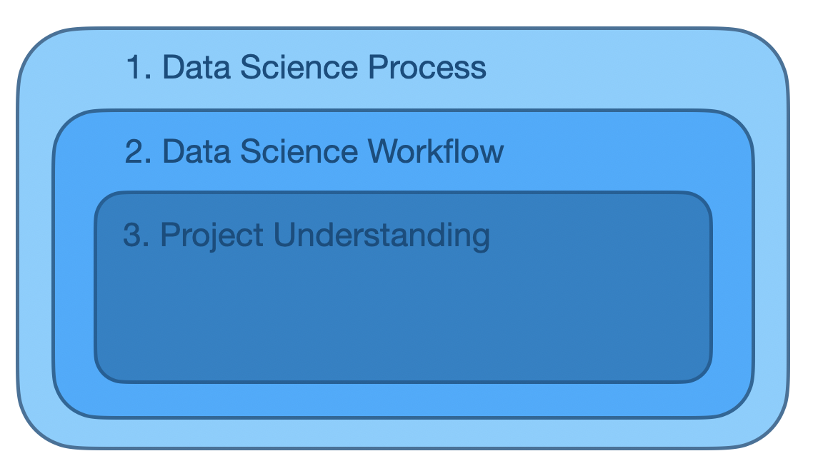
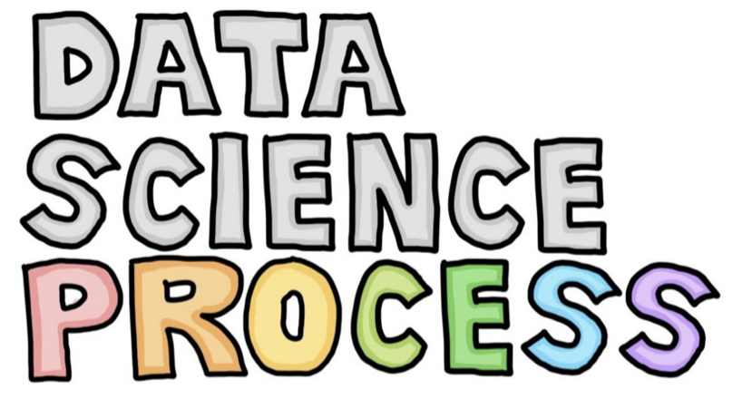
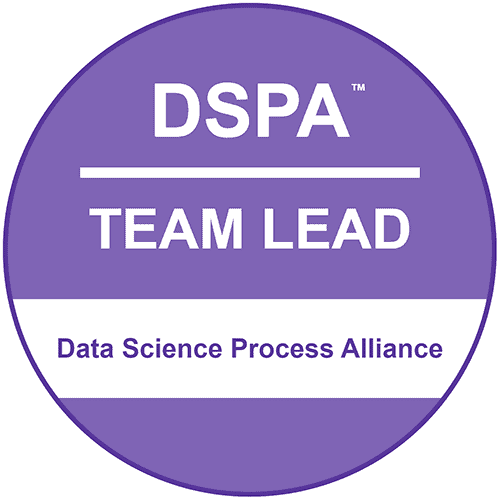
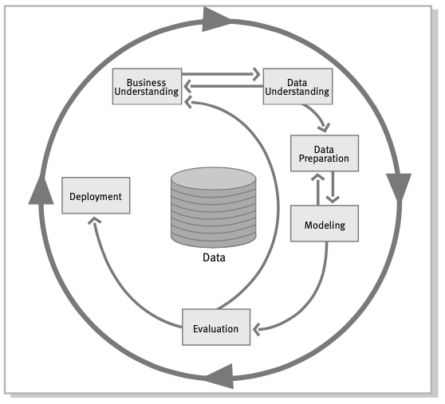
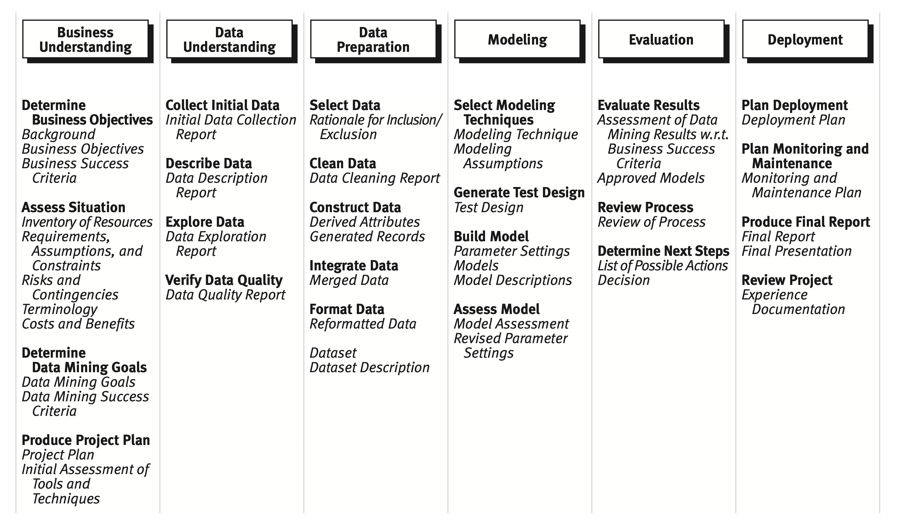
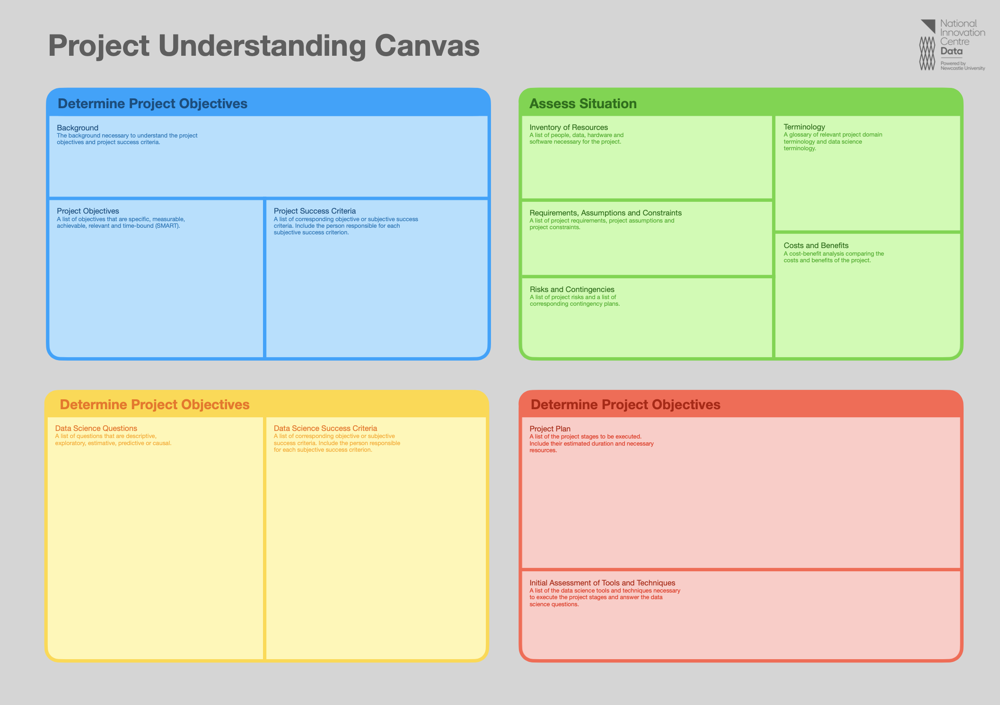
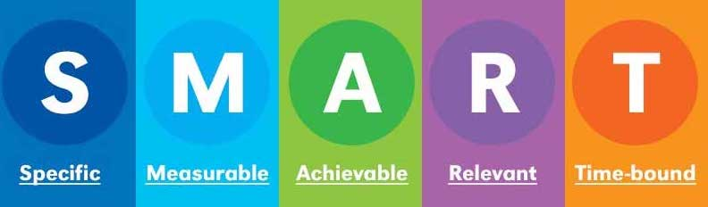
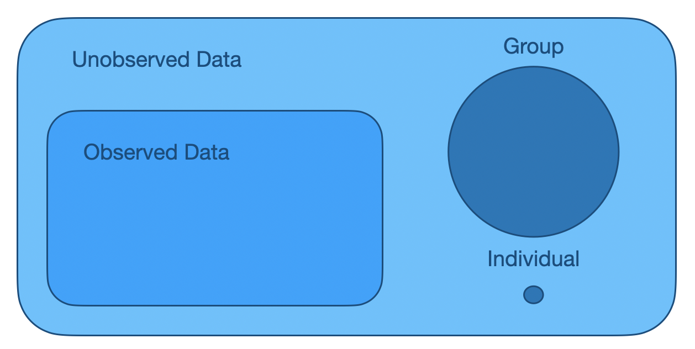
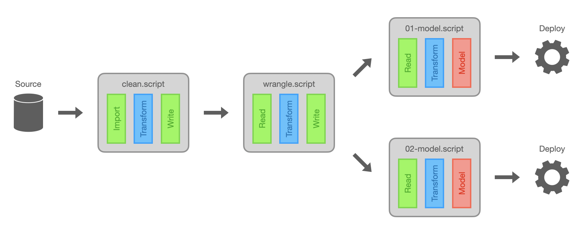
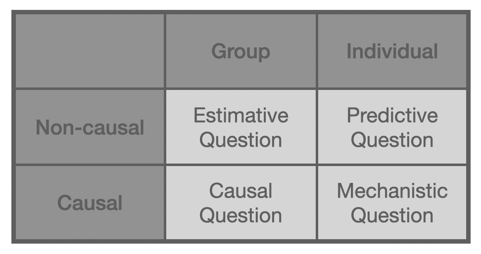

```{r setup, include=FALSE}
knitr::opts_chunk$set(echo = FALSE)
library(tidyverse)
```

## Introduction

This presentation about a data science scoping framework called **Project Understanding**.

{width=80%}

## Motivation

Learning a **data science scoping framework** is a great way to improve as a data scientist. 

{width=70%}

*"A less technical data scientist can be more effective than a more technical data scientist with the right data science scoping framework."*

# Data Science Process

## Data Science Process

- Anyone know a data science process?
- Anyone use a data science process?

{width=60%}

## Data Science Process

A **data science process** includes:

1. data science workflow (e.g. [CRISP-DM](https://www.the-modeling-agency.com/crisp-dm.pdf))
2. collaboration framework (e.g. [Data Driven Scrum](https://datadrivenscrum.com))

The data science workflow provides the **what** and the collaboration framework provides the **how**.

## Data Science Process

This workshop is not about data science processes is in general. To learn about data science processes I recommend the [Data Science Process Alliance](https://www.datascience-pm.com). This organisation provides **blogs** and **courses** (e.g. Data Science Team Lead).

{width=40%}

# Data Science Workflow

## Data Science Workflow

A data science workflow provides **guidance** (i.e. what tasks should be performed and how) during data science projects. Data science workflows aim to improve project:

1. consistency
2. efficiency
3. success rate

## Data Science Workflow

The results of a [poll](https://www.datascience-pm.com/crisp-dm-still-most-popular/) conducted by the DSPA of the most popular data science processes.

```{r processes, echo=FALSE}
process = c("CRISP-DM", "Scrum", "Kanban", "My Own", "TDSP", "Other", "None", "SEMMA")
percent = c(49, 18, 12, 12, 4, 3, 2, 1)
tibble(process = factor(process, levels = rev(process)), percent = percent) %>% 
  ggplot(aes(process, percent)) +
  geom_col(width = 0.8) +
  coord_flip() +
  scale_y_continuous(labels = scales::percent_format(scale = 1)) +
  labs(x = "", y = "")
```

## Data Science Workflow

Three of these data science processes are data science workflows:

- [CRISP-DM](https://www.the-modeling-agency.com/crisp-dm.pdf) (from **IBM**)
- [Team Data Science Process](https://docs.microsoft.com/en-us/azure/architecture/data-science-process/overview) (from **Microsoft**)
- [SEMMA](https://documentation.sas.com/doc/en/emref/14.3/n061bzurmej4j3n1jnj8bbjjm1a2.htm) (from **SAS**)

The most popular data science workflow is CRISP-DM.

## CRISP-DM

The **CRISP-DM** data science workflow:

- [most popular data science workflow](https://www.datascience-pm.com/crisp-dm-still-most-popular/) (49% usage)
- hierarchical structure of phases, tasks and outcomes
- comprehensive 76 page [CRISP-DM guide](https://www.the-modeling-agency.com/crisp-dm.pdf)
- CRISP-DM figure and table

## CRISP-DM

CRISP-DM consists of 6 **phases** and 24 **tasks**, see the [CRISP-DM guide](https://www.the-modeling-agency.com/crisp-dm.pdf) for details. The 6 phases of CRISP-DM are:

1. Business Understanding
2. Data Understanding
3. Data Preparation
4. Modelling
5. Evaluation
6. Deployment

These phases are represented as *vertices* in a directed graph were the *edges* represent transitions between phases.

## CRISP-DM

{width=60%}

## CRISP-DM

{width=100%}

## CRISP-DM

CRISP-DM is over thirty years old. NICD uses a modified CRISP-DM that has updated some of the phases, tasks and outcomes.

- We updated **Business Understanding** to **Project Understanding** for generality.

# Project Understanding

## Project Understanding

Project Understanding is a data science scoping framework. This presentation *only* focuses on the first phase of the NICD workflow.

**Why?**

- (probably) the most important phase
- data science scoping is under emphasised
- difference between a good and a great data scientist

## Project Understanding

Project Understanding has four tasks:

1. **Determine Project Objectives**
2. Assess Situation
3. **Determine Data Science Questions**
4. Plan Project

I would like to focus on the **first** and **third** tasks. 

## Project Understanding Canvas

{width=90%}

# Determine Project Objectives

## Determine Project Objectives

The **determine project objectives** task has **three** outcomes:

1. background
2. project objectives
3. success criteria

## Background

The background is a paragraph that provides the context to the project. For example, the background for your projects would include information about the **global climate change** and its effect on the **north east**.

{width=70%}

## Project Objectives

The **project objectives** task is the most *important* task. 

{width=80%}

A project objective can be the difference between a project being a **success** or a **failure**. 

## Project Objectives

So how to you determine a **good** project objective?



## Specific

Be as **specific** as you can! Global climate change is a very complex problem. Break a **complex** problem down into **simple** problems and determine a simple project objective.

- Simple project objectives are more likely to be a **success** and provide progress towards the broader goal. 
- Complex project objectives are more likely to be a **failure** and provide no progress towards the broader goal.

## Measureable

A project objective must be measurable to know if the project has been a success or a failure (next outcome). 

{width=50%}

## Acheivable, Time-bound

These are less important:

“In science, if you know what you are doing, you should not be doing it. In engineering, if you do not know what you are doing, you should not be doing it.” - **Richard Hamming**

In data **science** you don't know what you are doing. So you probably don't know if it is achievable or time-bound. 

## Relevant

Relevance is important. All projects have **stakeholders**. These are the people that determine if your project objectives are relevant or not. 

{width=70%}

Think about the result of a project success. Would this satisfy the stakeholders?

## Project Success Criteria

Since your project objective is measurable. The project success criteria is just a threshold. If the measure is above/below the threshold the project is a success/failure. 

Determining the threshold requires the project stakeholders. 

## Practice

Try producing a **project objective** and **project success criteria** for your project.

- examples?
- challenges?

# Determine Data Science Question

## Determine Data Science Question

The **determine data science question** task has two outcomes:

1. data science questions
2. data science success criteria

## Motivation

- the outcomes of the **determine project objectives** task are project objectives 
- a data science project attempts to achieve the project objectives with data
- the project objectives are connected to data with **data science questions**

{width=100%}

## Data Science Question

A **data science question** is a question that requires data to answer. In the paper [What is the question?](https://www.aaas.org/sites/default/files/Stats_What_Question_2015.pdf?g_zGQR5m3rDJqwXqJ3DxLI5pXZ3hNdHk), Jeffery Leek and Roger Peng identify **six** types of data science question.

1. descriptive
2. exploratory
3. estimative
4. predictive
5. causal
6. mechanistic

Identifying the type of a question can be **very hard**. To make this easier we introduce some terms. 

## Data Terms

{width=70%}

- **Observed Data** is in the dataset
- **Unobserved Data** is not in the dataset
- **Group** is a set of data points
- **Individual** is a data point

## Descriptive

- **Descriptive**: questions about the observed data
  - e.g. What is the maximum observed temperature?

Questions about unobserved data require models. These questions are **model-based** questions.

{width=60%}

## Estimative vs Predictive

- **Estimative**: questions about a group of unobserved data
  - e.g. What is the mean temperature over a region (spatial *group*) over a time period (temporal *group*)?
- **Predictive**: questions about an individual unobserved datum
  - e.g. What is the temperature at a location (*individual* spatial location) at a time (*individual* temporal point)?

## Causal vs Mechanistic

It is well known that **correlation does not imply causation**. So it is important to know when a question requires a causal answer or not.


{width=70%}

- **Causal**: causal estimative questions
- **Mechanistic**: causal predictive questions

## Question Types

- **Descriptive Question:** descriptive questions use tables and figures to summaries the dataset

**Model-based**

{width=60%}

## Motivation

Why are question types important?

1. different question types require different techniques
    - e.g. **Machine Learning** for predictive questions
    - e.g. **Bayesian Statistics** for estimative questions
2. answering a question type can be easy or hard
    - e.g. individual $>$ group
    - e.g. causal $>$ non-causal
    - e.g. model-based $>$ model-free
3. answer easy question types before hard question types

## Challenges

Project objectives might require question types that requires:

1. **techniques** that you do not currently have
2. **tools** that you do not currently have

This can help identify areas of improvement.

## Data Science Success Criteria

**data science success criteria** are about identifying when data science questions have been answered sufficiently. A criterion can be objective or subjective:

- **objective**: predict temperature with 98% accuracy
- **subjective**: develop insights temperature trends

The person responsible for each subjective success criterion must be included.

## Practice

Try producing a **data science question** and **data science success criteria** for your project.

- examples?
- challenges?

# Data Science Link

## Data Science Link

This is the most important figure.

{width=100%}

I am convinced that good **project objectives**, relevant **data** and good **data science questions** is what differentiates good and great data scientists.

# Questions?