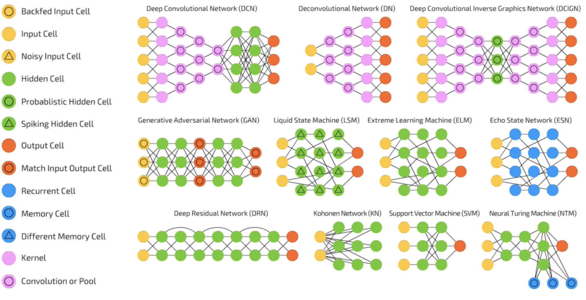

```{r setup, include=FALSE}
knitr::opts_chunk$set(echo = FALSE)
library(tidyverse)
```

# Data Science Worflows

## Data Science Process

A **data science process** includes:

1. data science workflow (e.g. [CRISP-DM](https://www.the-modeling-agency.com/crisp-dm.pdf))
2. collaboration framework (e.g. [Data Driven Scrum](https://datadrivenscrum.com))

The data science workflow provides the **what** and the collaboration framework provides the **how**. A popular example of a data science process is:

- [Team Data Science Process](https://docs.microsoft.com/en-us/azure/architecture/data-science-process/overview) (TDSP)

## Data Science Process

This workshop is about **data science workflows**. To learn about data science processes I recommend the [Data Science Process Alliance](https://www.datascience-pm.com). This organisation provides **blogs** and **courses** (e.g. Data Science Team Lead).

{width=40%}

## Data Science Workflow

A data science workflow provides **guidance** (i.e. what tasks should be performed and how) during data science projects. Data science workflows aim to improve project:

1. consistency
2. efficiency
3. success rate

## Data Science Workflow

The results of a [poll](https://www.datascience-pm.com/crisp-dm-still-most-popular/) conducted by the DSPA of the most popular data science processes.

```{r processes, echo=FALSE}
process = c("CRISP-DM", "Scrum", "Kanban", "My Own", "TDSP", "Other", "None", "SEMMA")
percent = c(49, 18, 12, 12, 4, 3, 2, 1)
tibble(process = factor(process, levels = rev(process)), percent = percent) %>% 
  ggplot(aes(process, percent)) +
  geom_col(width = 0.8) +
  coord_flip() +
  scale_y_continuous(labels = scales::percent_format(scale = 1)) +
  labs(x = "", y = "")
```

## Data Science Workflow

Three of these data science processes are data science workflows:

- [CRISP-DM](https://www.the-modeling-agency.com/crisp-dm.pdf) (from **IBM**)
- [Team Data Science Process](https://docs.microsoft.com/en-us/azure/architecture/data-science-process/overview) (from **Microsoft**)
- [SEMMA](https://documentation.sas.com/doc/en/emref/14.3/n061bzurmej4j3n1jnj8bbjjm1a2.htm) (from **SAS**)

The most popular data science workflow is CRISP-DM.

## CRISP-DM

The **CRISP-DM** data science workflow:

- [most popular data science workflow](https://www.datascience-pm.com/crisp-dm-still-most-popular/) (49% usage)
- hierarchical structure of phases, tasks and outcomes
- comprehensive 76 page [CRISP-DM guide](https://www.the-modeling-agency.com/crisp-dm.pdf)
- CRISP-DM figure and table (see CRISP-DM guide)

## CRISP-DM

CRISP-DM consists of 6 **phases** and 24 **tasks**, see the [CRISP-DM guide](https://www.the-modeling-agency.com/crisp-dm.pdf) for details. The 6 phases of CRISP-DM are:

1. Business Understanding
2. Data Understanding
3. Data Preparation
4. Modelling
5. Evaluation
6. Deployment

These phases are represented as *vertices* in a directed graph were the *edges* represent transitions between phases.

## CRISP-DM

{width=60%}

## CRISP-DM

{width=100%}

## CRISP-DM

CRISP-DM is over thirty years old now. NICD uses a modified CRISP-DM that has updated some of the phases, tasks and outcomes. This workshop covers: 

1. Determine Data Science Questions (**task**)
2. Data Preparation (**phase**)
4. Modelling (**phase**)

# Determine Data Science Questions

## Determine Data Science Questions

The **determine data science questions** task involves **two** outcomes:

1. data science questions
2. data science success criteria

These will be discussed in turn.

## Motivation

- the outcomes of the **determine project objectives** task (not covered) are project objectives 
- a data science project attempts to achieve the project objectives with data
- the project objectives are connected to data with **data science questions**

{width=100%}

## Data Science Question

A **data science question** is a question that requires data to answer. In the paper [What is the question?](https://www.aaas.org/sites/default/files/Stats_What_Question_2015.pdf?g_zGQR5m3rDJqwXqJ3DxLI5pXZ3hNdHk), Jeffery Leek and Roger Peng identify **six** types of data science question:

1. descriptive
2. exploratory
3. estimative
4. predictive
5. causal
6. mechanistic

Identifying the type of a question can be **very hard**. To make this easier we introduce some terms. 

## Data Terms

1. **Individual**: single data point
2. **Population**: set of all *possible* data points
3. **Sample**: subset of all *possible* data points (e.g. dataset)

**Example**

Collecting data from students (i.e. individuals) in a class (i.e. sample) in a school (i.e. population). 

**Purpose**

Some question types relate to individuals and some question types relate to populations.

## Data Terms


## Models

Models are used to combine **prior information** with data. Statistics and Machine Learning techniques use models:

- e.g. linear regression models
- e.g. deep learning models

**Purpose**

Some question types require a model and some question types do not.

## Causation

It is well known that **correlation does not imply causation**. So it is important to know when a questions requires a causal answer or not.


{width=70%}


**Purpose**

Some question types require a causal answer and some question types do not.

## Question Types

- **Descriptive Question:** descriptive questions use tables and figures to understand the sample
- **Exploratory Question:** exploratory questions are descriptive questions that require interpretation

**Model-Based Questions**

{width=60%}

## Practice

**What data science questions are you asking?**

## Motivation

Why are question types important?

1. different question types require different techniques
    - e.g. **Machine Learning** for predictive questions
    - e.g. **Bayesian Statistics** for estimative questions
2. answering a question type can be easy or hard
    - e.g. individual $>$ population
    - e.g. causal $>$ non-causal
    - e.g. model-based $>$ model-free
3. answer easy question types before hard question types
4. ensuring actual and perceived question types are the same

## Actual vs Perceived

{width=100%}

## Challenges

Project objectives might require question types that requires:

1. **techniques** that your team does not currently have
2. **tools** that your organisation does not currently have

This can help an organisation identify areas of improvement.

## Data Science Success Criteria

**data science success criteria** are about identifying when data science questions have been answered sufficiently. A criterion can be objective or subjective:

- **objective**: predict churn with 98% accuracy
- **subjective**: develop insights about churn

The person responsible for each subjective success criterion must be included.

# Data Preparation

## Data Preparation

The **data preparation** phase of the NICD data science workflow includes two tasks:

1. cleaning data
2. wrangling data

This presentation is going to focus on organising data transformations into cleaning and wrangling and a project template that facilitates this. 

## Project Templates

A **good** project template should be:

1. broadly applicable
2. encourage good practice
3. language agnostic

Developing a broadly applicable project template requires defining some broad data science terms. These terms are:

- **data question**
- **data source**
- **data product**
- **data pipeline**.

## Data Question

A **data question** is a question related to data, introduced in [What is the Question?](https://www.aaas.org/sites/default/files/Stats_What_Question_2015.pdf?g_zGQR5m3rDJqwXqJ3DxLI5pXZ3hNdHk) There are six types of data question:

1. descriptive
2. exploratory
3. estimative
4. predictive
5. causal
6. mechanistic

## Data Source

A data question requires one or more relevant datasets. A dataset is available from a **data source**. Data sources include:

- databases
- flat files (e.g. CSV file)
- web services (e.g. web API)

**Note**: Different data questions require different data sources.

## Data Product

A data question requires an answer. The answer to a data question is a **data product**. Data products include:

- tables
- figures
- reports
- models

**Note**: Different data questions require different data products.

## Data Pipeline

A **data pipeline** imports data from one or more data sources and transforms that data into a data product that is deployed. This could be performed in a single `pipeline.script`:

{width=100%}

## Project Template Development

The NICD project template has four directories:

1. `src/` directory
2. `data/` directory
3. `reports/` directory
4. `notebooks/` directory

The **structure** and **reasoning** for these directories follows. The emphasis is on encouraging good practice.

## `src/` Directory

Different data questions require different data pipelines (different data sources and products). It is important that data pipelines can be efficiently **developed** and **maintained** when the data question *inevitably* changes. This can be facilitated by:

1. question independent code in `clean/` directory
2. a `clean.script` for each data source
3. question dependent code in `wrangle/` directory
4. a `wrangle.script` for each data question
5. model dependent code in `model/` directory
6. a `model.script` for each model-based data product

Other data products will follow.

## `src/` Directory

{width=100%}

## `src/` Directory

{width=100%}
    
## `src/` Directory

{width=100%}

## `data/` Directory

The clean, wrangle and model scripts should write data to different data directories:

1. `clean.script` writes to `data/clean/`
2. `wrangle.script` writes to `data/wrangle/`
3. `model.script` writes to `data/model/`

The `clean/` and `wrangle/` data directories match the `staging/` and `production/` directories in the [Cloud Data Platform](https://www.manning.com/books/designing-cloud-data-platforms) architecture and the `silver/` and `gold/` directories in the [Databricks Medallion](https://databricks.com/notebooks/delta-lake-cdf.html) architecture. 

## `reports/` Directory

Tables and figures in reports are the data products that answer descriptive and exploratory questions. Reports require many artefacts (tables, figures and files) that should be contained in a report directory (`reports/<report_name>/`).

## `notebooks/` Directory

In order to populate the pipeline scripts with transformations, data exploration is required. Data exploration is best performed in notebooks (e.g. `.ipynb` and `.Rmd` files). It is recommended:

1. notebooks should *not* include pipeline transformations
2. notebooks are not used for collaboration
3. notebooks use naming: `<ghuser>-<notebook_name>`

## Project Template

```
README.md
config.yml
data/
├─ clean/
├─ model/
├─ raw/
├─ wrangle/
notebooks/
reports/
src/
├─ clean/
│  ├─ clean.script
├─ model/
│  ├─ model.script
├─ wrangle/
│  ├─ wrangle.script
```

# Modelling

## Experimental Design